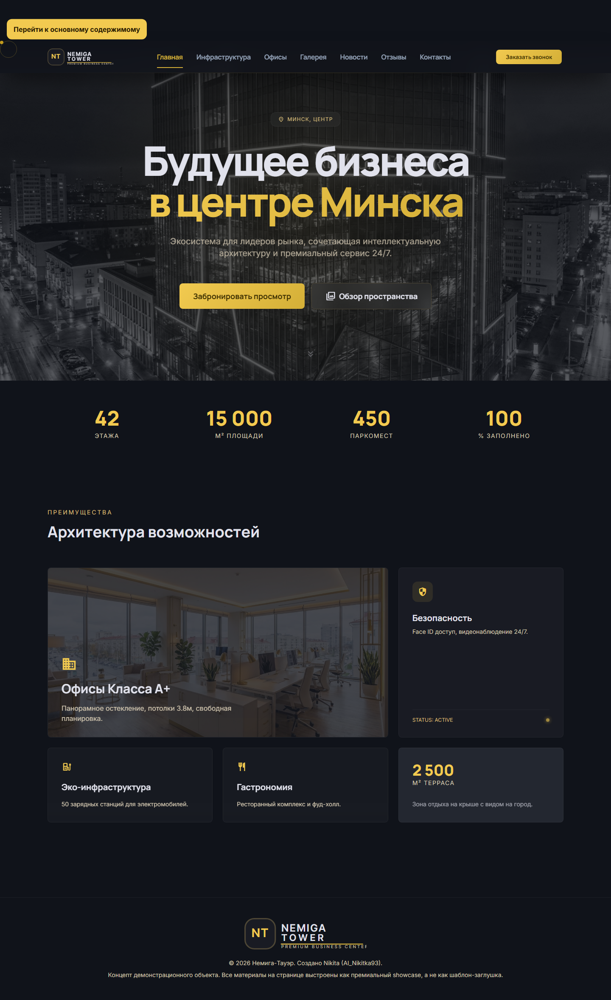

# Nemiga Tower

[Русский](./README.ru.md) | **English**

Premium business-center showcase landing page built as a public portfolio surface. Nemiga Tower combines a polished one-page UI, responsive behavior, accessibility details, visual regression checks, and a GitHub Pages deployment flow in a compact static-site repository.

[Live demo](https://ai-nikitka93.github.io/NemigaTower/) · [Contributing](./CONTRIBUTING.md) · [Security](./SECURITY.md)

| Surface | Status |
| --- | --- |
| Repository type | `SaaS / app repository` demo |
| Runtime | Static `HTML` + `Tailwind CSS CDN` + `Vanilla JavaScript` |
| Verification | Playwright visual regression for desktop and mobile |
| Deployment | GitHub Pages via [`.github/workflows/pages.yml`](./.github/workflows/pages.yml) |
| Reuse rights | `UNLICENSED` until a root `LICENSE` file is added |



## What This Repo Is

Nemiga Tower is a premium real-estate style landing page concept for a fictional Minsk business center. The repository is optimized for quick portfolio review: a single primary UI file, a small build script, a clean deploy path, and enough QA automation to keep presentation regressions visible.

Use this repository when you want to:

- showcase premium marketing UI craft in a lightweight static stack
- study a single-page landing page with accessibility-minded interactions
- reuse the deployment and visual-regression workflow for a GitHub Pages site

## Quickstart

Prerequisites:

- `Node.js 20+`
- `npm`
- `Python 3` for the local static server used by `npm run serve`

```bash
git clone https://github.com/AI-Nikitka93/NemigaTower.git
cd NemigaTower
npm install
npm run serve
```

Default local URL: `http://127.0.0.1:41873/`

Useful commands:

```bash
npm run build
npm run serve
npm run test:visual
npm run test:visual:update
```

## What It Does

- presents a premium dark-and-gold landing page with section-based navigation
- includes a rental calculator with live exchange-rate usage from the NBRB API
- keeps keyboard access in mind with `skip-link`, visible focus states, and accessible modal behavior
- verifies key desktop and mobile states with Playwright screenshots
- deploys the built `dist/` artifact to GitHub Pages from `main`

## Build And Deploy Flow

The repository keeps the shipping path intentionally small:

1. [`index.html`](./index.html) contains the main UI, content, and interaction logic.
2. [`scripts/build.mjs`](./scripts/build.mjs) copies `index.html`, collects referenced assets, and writes `build_metadata.json`.
3. The build outputs a static [`dist/`](./dist) directory with `.nojekyll`.
4. [GitHub Actions](./.github/workflows/pages.yml) publishes the artifact to GitHub Pages.

## Project Layout

```text
NemigaTower/
├── .github/
│   ├── workflows/pages.yml
│   ├── ISSUE_TEMPLATE/
│   ├── CODEOWNERS
│   └── PULL_REQUEST_TEMPLATE.md
├── assets/
├── docs/screenshots/
├── scripts/build.mjs
├── tests/visual.spec.js
├── tests/__screenshots__/
├── CONTRIBUTING.md
├── SECURITY.md
├── README.md
├── README.ru.md
└── index.html
```

## Quality And Review

- Visual baselines live in [`tests/__screenshots__/`](./tests/__screenshots__).
- The visual suite covers homepage, infrastructure, offices, contacts, and media-tour states on desktop and mobile.
- Public contribution paths are defined in [`CONTRIBUTING.md`](./CONTRIBUTING.md), [`CODE_OF_CONDUCT.md`](./CODE_OF_CONDUCT.md), issue forms in [`.github/ISSUE_TEMPLATE`](./.github/ISSUE_TEMPLATE), and review ownership in [`.github/CODEOWNERS`](./.github/CODEOWNERS).

## Project Status

This is an actively maintained demo repository, not a production website for a real business center. Forms are showcase-only and do not submit to a backend. Some runtime resources still come from third-party CDNs.

## License

No reusable open-source license has been added yet. Until a root `LICENSE` file exists, treat the repository as not licensed for reuse. The package metadata is marked `UNLICENSED` to make that posture explicit.
